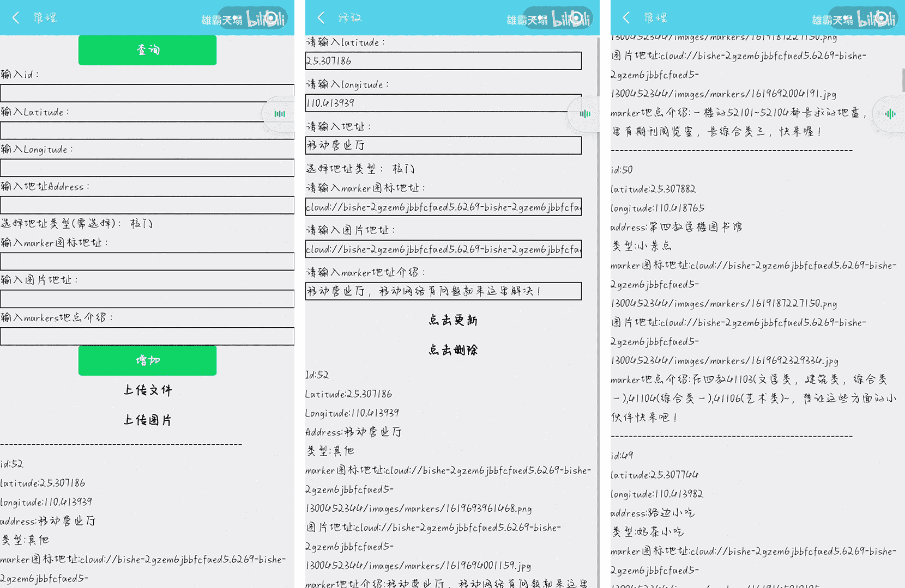

 
    <h1> 信科校园导览小程序 </h1>

基于云开发的校园导航小程序  
提供校园导航和校园信息服务，具有出色的用户体验

***原作者B站演示视频：https://b23.tv/meIeeBW***  

☑️地图选点与搜索  ☑️校园游览路线  ☑️校园信息展示  ☑️在线管理地点

原生小程序 + 腾讯位置服务路线规划插件 + 云开发能力

---

# 📖 介绍

信科校园导览小程序（原作者毕设）  

微信小程序地图，涵盖定位/maker点详情/导航/导览；包括校园信息，公交信息，天气信息，登录后，可以进入后台管理，增删改查maker信息  

**非常不错的小程序，给原作者点个赞！💖**

---

# 📢 现状

原作者因费用问题已关闭云开发，现小程序没有后端数据。  

原作者在评论区放出的网站链接中只有部分代码，且大都失效。

**联系上作者后给了我源码，我在此基础上对少数页面的前端进行了优化**  

---

# 🤩 预览 + 分析

## 1. 地图和选择类别

给including-points加了padding

  

## 2. 点击地点显示自定义弹窗

使用了weui的mp-dialog组件

## 3. 点聚合和校园游览路线

Polyline

## 4. 搜索和导航

调用腾讯路线规划插件实现

## 5. 校园信息页

页面文字调整一下，加个间距之类的会更好

## 6. 校园信息

同上

## 7. 天气和个人中心

调用天气API，我的页面要点击授权才显示。上面放视频的话最好调整一下边距或者布局会有更好显示效果

## 8. 后台管理

后台管理，判断当前微信用户openid是否在云数据库集合中

感觉这样操作不太好使，可以看看[我的项目](https://gitee.com/talmudmaster/GLU-Campus-Guide)的方法，如下

---

# 🎨 前端界面UI优化

我在原作者源码基础上对少数页面的前端进行了优化

## 原项目

## **优化后**

